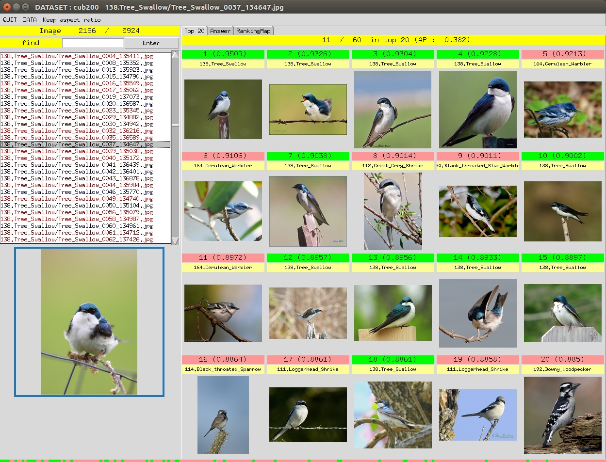
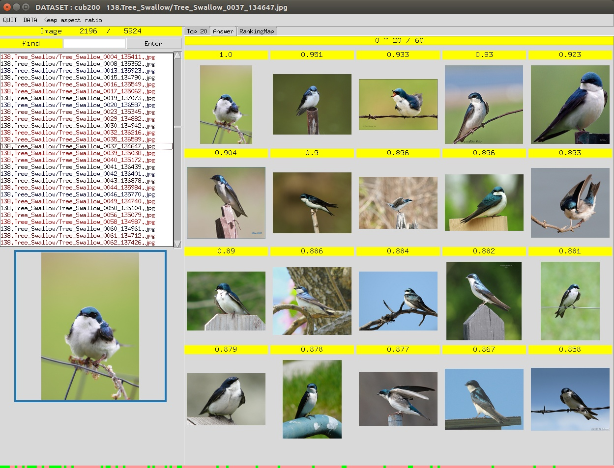
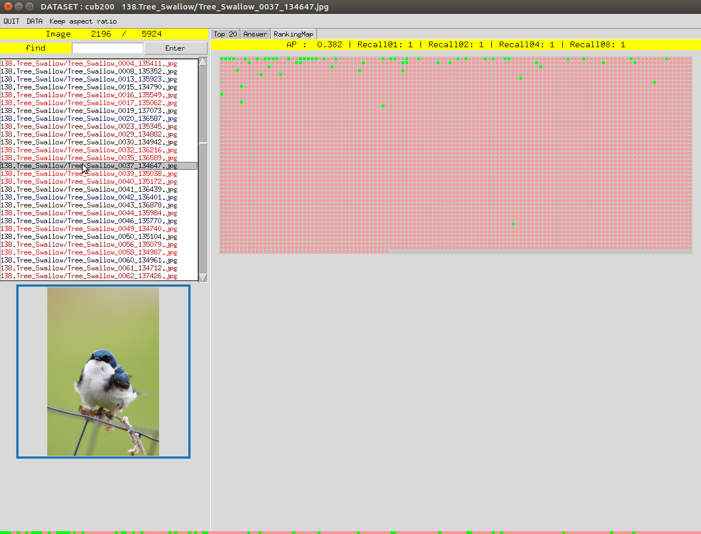

# ImageRetrievalGUI


## Introuction

This is a lightweight GUI for visualizing the Image Retrieval results, and would be convenient for verifying the results and groundtruth. 

[](https://www.youtube.com/watch?v=xUfO5MMAR5M)
[](https://www.youtube.com/watch?v=xUfO5MMAR5M)
[](https://www.youtube.com/watch?v=xUfO5MMAR5M)

Demo video : https://www.youtube.com/watch?v=xUfO5MMAR5M

## Repository Structure

```
Repository
├── demo
│   ├── demo1.jpg
│   ├── demo2.jpg
│   └── demo3.jpg
├── extract_feats.py
├── libs
│   ├── datasets.py
│   ├── models.py
│   └── utils.py
├── LICENSE
├── main.py
├── query_images
│   ├── q_001.jpg
│   ├── q_002.jpg
│   ├── q_003.jpg
│   ├── q_004.jpeg
│   ├── q_005.jpg
│   └── q_006.jpg
├── README.md
├── cars196_checkpoint.pth.tar (should be added)
├── cub200_checkpoint.pth.tar (should be added)
└───Datasets (should be added)
|    ├── cub200
|    ├── cars196
```

## Dataset Structures
__CUB200-2011/CARS196__
```
cub200/cars196
└───images
|    └───001.Black_footed_Albatross
|           │   Black_Footed_Albatross_0001_796111
|           │   ...
|    ...
```

## Demo


# Clone this repository.

```
git clone https://github.com/Chien-Hung/ImageRetrievalGUI.git
cd ImageRetrievalGUI
```

# Train a model for extracting image feature

For this demo, you should train a resnet50 models for cub200 / cars196 dataset by [Deep-Metric-Learning-Baselines](https://github.com/Confusezius/Deep-Metric-Learning-Baselines). Or you can download the trained checkpoints [cub200_checkpoint.pth.tar](https://drive.google.com/file/d/1Gem3-9mzutHbNtBVQS8yIi_DPOG0YV2S/view?usp=sharing) / [cars196_checkpoint.pth.tar](https://drive.google.com/file/d/1wvP3Engemk9RTwiE6cZJjjjonXLXscEA/view?usp=sharing).

Link to the Deep-Metric-Learning-Baselines datasets or download the cub200 / cars196 dataset in this folder.

```
ln -s Deep-Metric-Learning-Baselines/Datasets ./Datasets
```

# Extract image collection features by the trained model.

This offer the trained checkpoints for demo.

```
python extract_feats.py --dataset cub200 --ckpt cub200_checkpoint.pth.tar
```

```
python extract_feats.py --dataset cars196 --ckpt cars196_checkpoint.pth.tar
```

# Display the results.

```
python main.py --dataset cub200 --ckpt cub200_checkpoint.pth.tar 
```

```
python main.py --dataset cars196 --ckpt cars196_checkpoint.pth.tar
```

---

## Hotkeys

|     KEY    | ACTION                                    |
|:----------:|-------------------------------------------|
|   ↑ , ↓    | change image.                              |
|   ← , →    | change tab.                                | 
|     q     | colse this GUI.                            |

---

## Reference  

https://github.com/Confusezius/Deep-Metric-Learning-Baselines
