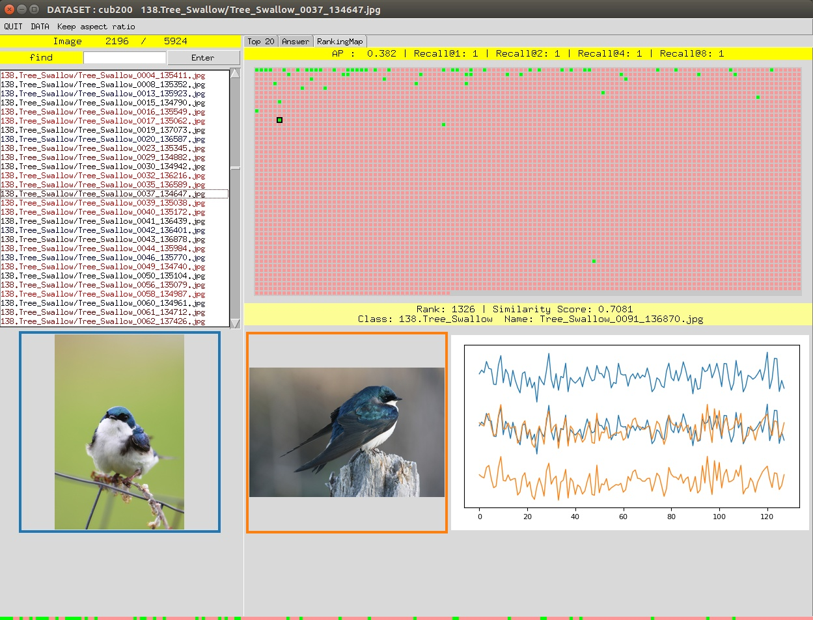

# ImageRetrievalGUI


---

## Introuction

This is a lightweight GUI for visualizing the Image Retrieval results, and would be convenient for verifying the results and groundtruth. 

[]
[]
[]


## Demo


# Clone this repository.

```
git clone https://github.com/Chien-Hung/ImageRetrievalGUI.git
cd ImageRetrievalGUI
```

# Train a model for extracting image feature

For this demo, I trained resnet50 models by [Deep-Metric-Learning-Baselines](https://github.com/Confusezius/Deep-Metric-Learning-Baselines). 

Link the datasets.

```
ln -s Deep-Metric-Learning-Baselines/Datasets ./Datasets
```

# Extract image collection features by the trained model.

This offer the trained checkpoints for demo.

```
python extract_feats.py --dataset cars196 --ckpt cars196_checkpoint.pth.tar
```

```
python extract_feats.py --dataset cub200 --ckpt cub200_checkpoint.pth.tar
```

# Display the results.

```
python main.py --dataset cub200 --ckpt cub200_checkpoint.pth.tar 
```

```
python main.py --dataset cars196 --ckpt cars196_checkpoint.pth.tar
```

---

## Hotkeys

|     KEY    | ACTION                                    |
|:----------:|-------------------------------------------|
|   ↑ , ↓    | change image.                              |
|   ← , →    | change tab.                                | 
|     q     | colse this GUI.                            |

---

## Reference  

https://github.com/Confusezius/Deep-Metric-Learning-Baselines
